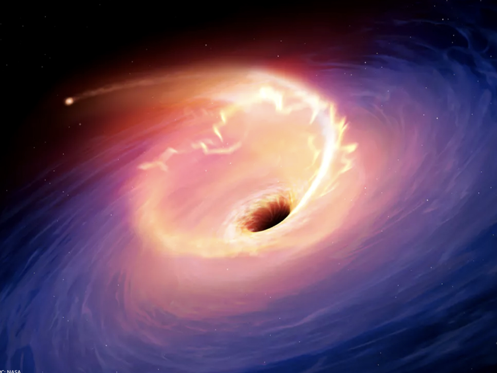
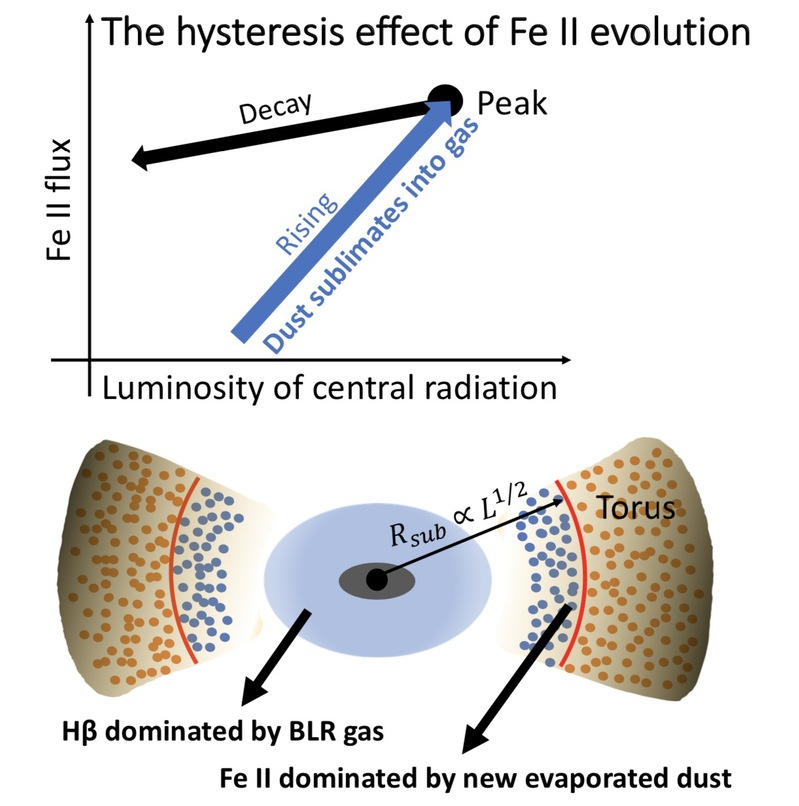

A team leaded by Prof. Tinggui Wang from the Department of astronomy, University of science and technology of China first detected the hysteresis effect of optical iron emission in the TDE event. The paper was published online in the international famous academic journal the Astrophysical Journal Letters on January 28, 2021.

**Figure 1. the ongoing TDE event in AGNs. (schematic, from network)**

Supermassive black holes generally exist in the center of galaxies. When they are in the stage of high-speed accretion growth, they appear as active galactic nuclei (AGNs). The multi-component mixed iron emission (Fe II) is one of the most important characteristics of the ultraviolet and optical spectra of AGN. It is found that there is a good correlation between optical Fe II intensity and Eddington ratio, which can be used as the indicator of Eddington ratio. The Eddington ratio is one of the most important physical quantities to describe the black hole accretion system and to construct the main sequence of black hole activities. However, due to the complexity of iron energy levels, the mechanism and region of iron emission production are not clear, which seriously restricts our understanding of AGN.

In recent years, the rapid development of time-domain sky surveys has also found a number of black hole temporary accretion events different from AGN, which are called black hole tidal disruption events (TDEs). If TDE occurs in AGN (Fig. 1), the black hole accretion rate will change dramatically from month to year time scale, which provides an excellent opportunity to study the response of emission lines to central radiation and understand the structure of AGN. The early work of the our team detected the strong infrared echo signal of the dust torus in the famous events such as ps16dtm and ps1-10adi, and the early stage was accompanied by the dust sublimation process. Therefore, it was speculated that the iron element in the dust was released into the gaseous state, and then the observed enhanced Feii radiation was generated.

By carefully analyzing the spectra of ps1-10adi at different stages, we found an extraordinary response of optical Fe II line to central radiation (the Fe II response before and after TDE burst has different power-law exponent, Fig. 2) for the first time. At the same central luminosity, the intensity of Feii after the explosion is higher than that before the explosion, which indicates that the amount of iron produced during the explosion is indeed increased. When the central luminosity decays to the level before the explosion, the intensity of Fe II does not return back to the level before the explosion, but is higher than that before the explosion, which is a **hysteresis effect**. This kind of effect is common in many fields. It is a kind of path dependent effect, that is, the state of the system is not only related to the input of the current system, but also has different results because of the different paths of the past input process. This effect is first found in optical band of AGNs SED. The hysteresis effect of the Fe II line can be explained as that the Fe II line in TDE originates from the gas just sublimated from the dust. However, We didn't find this phenomenon in Hβ and the response of Hβ was consistent before and after the outbreak. This interpretation, together with the weak response of the Hβ emission as we observe, naturally explains the applicability of relative Fe ii strength as a tracer of the Eddington ratio. In addition,optical iron emission of this origin renders the Fe II time lag a potential "standard candle" with cosmological implications.

**Figure 2: a demonstration of hysteresis effect of Fe II response in TDE event**

This work further proves that TDE events in AGN have important research value for understanding black hole accretion system. The Wide Field Survey Telescope (WFST) built by USTC and Purple Mountain Observatory is expected to find a large number of such events, which is expected to strongly promote the development of this field. The first author and co corresponding author of the paper is Dr. Zhicheng He, a special associate researcher of the Department of astronomy. Dr. Jiang Ning, associate researcher of the Department of astronomy, and Professor Wang Tinggui are the co-corresponding authors of the paper. This research is supported by the key Youth Innovation Fund of China University of science and technology, the National Natural Science Foundation of China and the national key R & D projects of the Ministry of science and technology.

---

Links to related papers:

- [An Extraordinary Response of Iron Emission to the Central Outburst in a Tidal Disruption Event Candidate *--Zhicheng He et al 2021 ApJL 907 L29*](https:/iopscience.iop.org/article/10.3847/2041-8213/abd7fd)

- [Infrared Echo and Late-stage Rebrightening of Nuclear Transient Ps1-10adi: Exploring the Torus with Tidal Disruption Events in Active Galactic Nuclei *--Ning Jiang et al 2019 ApJ 871 15*](https://iopscience.iop.org/article/10.3847/1538-4357/aaf6b2)

- [Mid-infrared Flare of TDE Candidate PS16dtm: Dust Echo and Implications for the Spectral Evolution *--Ning Jiang et al 2017 ApJ 850 63*](https://iopscience.iop.org/article/10.3847/1538-4357/aa93f5)
